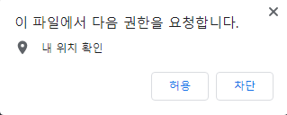
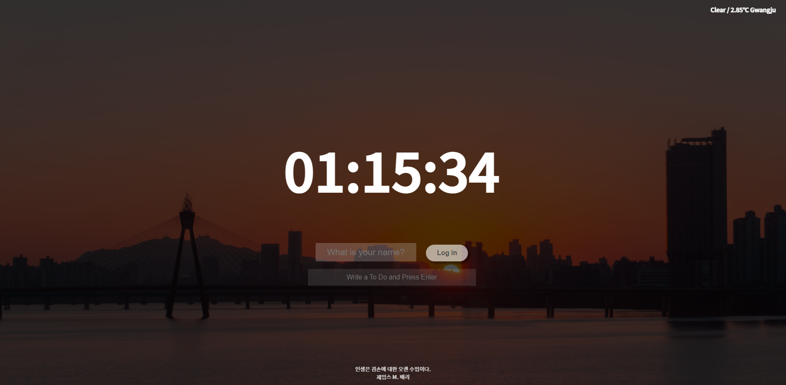
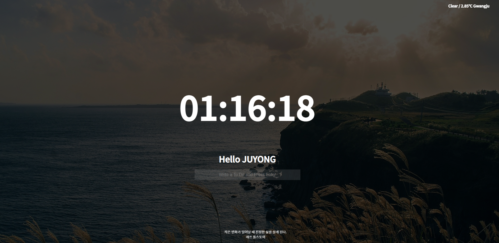
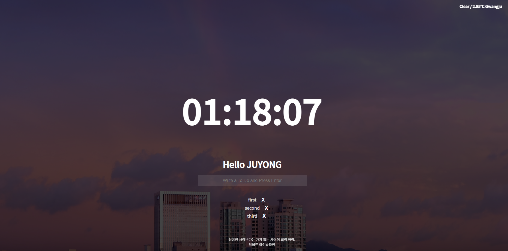

## 노마드 코더 - 클론코딩

# 바닐라 JS로 크롬 앱 만들기

WEATHER API에서 API 키를 발급받은 다음 적용해주면 위와 같이 위치확인 권한 요청이 뜹니다. 허용을 해주면 밑의 화면 우상단에서 보이는 날씨정보/온도 지역 이 차례대로 뜹니다.

https://nomadcoders.co/javascript-for-beginners/lectures/2866

노마드코더 강의를 들으며 만들었습니다.

API_KEY는 보안상 지웠습니다.
